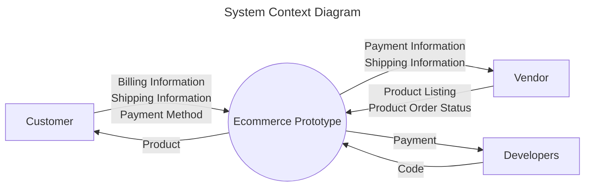
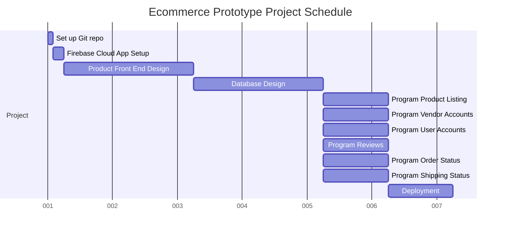

# Ecommerce Prototype Project Plan

[Team Members](../authors.md)

# Table of Contents

1. [Introduction](#introduction)
    1. [Scope and Purpose](#scope-and-purpose)
2. [System Scope](#system-scope)
    1. [Problem/Opportunity Description](#problemopportunity-description)
    2. [Anticipated Business/Personal Benefits](#anticipated-businesspersonal-benefits)
    3. [System Capabilities](#system-capabilities)
3. [System Context](#system-context)
4. [Schedule](#schedule)
5. [Staff Organization](#staff-organization)
6. [Tracking and Control Mechanisms](#tracking-and-control-mechanisms)

## Introduction

### Scope and Purpose

In this project we are creating an Ecommerce website that is similar to existing marketplaces such as Amazon. This
Project has 2 roles, one for users and one for vendors. The functionalities of each role are as follows:

**Common Functionalities:**

- Signing in to the system
- Signing up to the system
- Signing in with Google

**User:**

- Purchase a product
    - Add shipping information for delivery
    - Add billing information for charging product cost
    - Purchase confirmation with the last product price that includes taxes
- Search for products in the website
- Rate a product after purchase
- View a product
    - View the ratings of that product
- View order status

**Vendor:**

- Create a product listing
    - Add description, cost, weight, dimensions, stamps of approval
- View listed products
- Update product order status

## System Scope

### Problem/Opportunity Description

The goal of our project is to create an affordable, reliable marketplace for selling and shipping various products.
Giving our customers the ability to purchase products online without having to go to a physical store helps them reduce
the time they spend shopping and their carbon footprint. Customers will be shopping from a safe marketplace without
worrying about possible faulty products because they will have stamps of approval by the marketplace management. Vendors
will have the opportunity to sell their products without leasing a physical store allowing them to save money on fixed
costs.

### Anticipated Business/Personal Benefits

Our company hopes to make a breakthrough in the ECommerce industry, creating an app similar to Amazon. The benefits to
the user will be a reliable and easily accessible application to get the products they want without having to go to a
physical store, saving our customers time and money. The benefit to the vendors is to create a business and sell
products without having to advertise and also without having to have a physical store.

<!-- demonstration comment -->

### System Capabilities

1. User Authentication
    1. Sign in and Sign up feature along with ability to sign in through Google.
2. Product Listing'
    1. Creating a product listing with:
        1. Description, Cost, Weight, Dimensions, Reviews, Stamps of Approval
    2. Viewing products that are listed
3. Reviews
    1. Star rating system [0, 5]
    2. Writing and viewing reviews.
4. Product Purchasing
    1. Payment Method, Shipping Info, Shipping Cost, Purchase Confirmation, Tax Calculation
5. Product Search
    1. Search bar feature that allows you to search for featured products and popular products by the name.
6. Product Shipping Status
    1. Updating product order status
    2. Viewing products order status
    3. Allows the user to track the status of their package through the respective shipping service (FedEx, UPS).

### System Context Diagram

## Schedule

X axis represents days spent on project.

## Staff Organization

Jesse Trevena is the team leader. We will organize our assignments and discuss recent accomplishments during weekly
meetings, similar to a scrum.

## Tracking and Control Mechanisms

We are using GitHub to commit changes to our documentation.
Technologies used include Git hosted on GitHub, Discord, and Google Drive.
<!-- If you're reviewing this, add a comment to this line on GitHub -->
