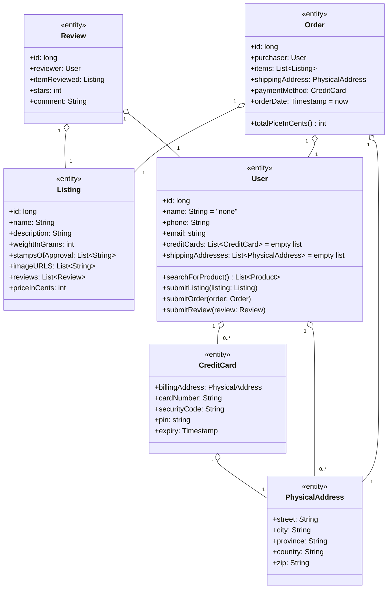

# Introduction

# Design-Level Class Diagrams

```mermaid
classDiagram
    direction TD
    
    Review "1" o-- "1" Listing
    Order "1" o-- "1" Listing
    CreditCard "1" o-- "1" PhysicalAddress
    User "1" o-- "0..*" CreditCard
    User "1" o-- "0..*" PhysicalAddress
    Review "1" o-- "1" User
    Order "1" o-- "1" User
    Order "1" o-- "1" PhysicalAddress
    
    class User {
        <<entity>>
        +id: long
        +name: String = "none"
        +phone: String
        +email: string
        +creditCards: List&ltCreditCard&gt = empty list
        +shippingAddresses: List&ltPhysicalAddress&gt = empty list
        +searchForProduct() List&ltProduct&gt
        +submitListing(listing: Listing)
        +submitOrder(order: Order)
        +submitReview(review: Review)
    }
    
    class Listing {
        <<entity>>
        +id: long
        +name: String
        +description: String
        +weightInGrams: int
        +stampsOfApproval: List&ltString&gt
        +imageURLS: List&ltString&gt
        +reviews: List&ltReview&gt
        +priceInCents: int
    }
    
    class Order {
        <<entity>>
        +id: long
        +purchaser: User
        +items: List&ltListing&gt
        +shippingAddress: PhysicalAddress
        +paymentMethod: CreditCard
        +orderDate: Timestamp = now
        +totalPiceInCents() int
    }
    
    class Review {
        <<entity>>
        +id: long
        +reviewer: User
        +itemReviewed: Listing
        +stars: int
        +comment: String
    }
    
    class CreditCard {
        <<entity>>
        +billingAddress: PhysicalAddress
        +cardNumber: String
        +securityCode: String
        +pin: string
        +expiry: Timestamp
    }
    
    class PhysicalAddress {
        <<entity>>
        +street: String
        +city: String
        +province: String
        +country: String
        +zip: String
    }
    
```

# Object Statechart Diagrams

1. Order

2. Review

3. Listing

4. Credit Card

5. User

   

# First Cut Domain Sequence Diagram
