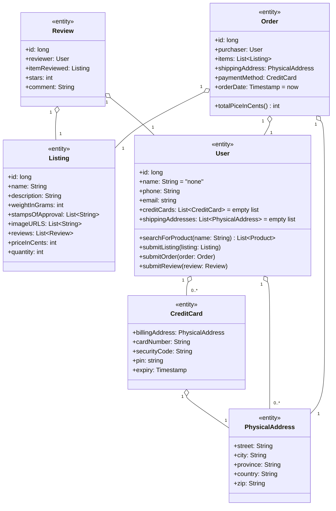
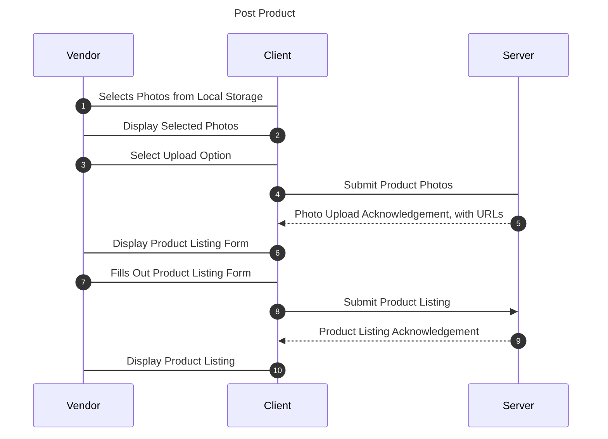
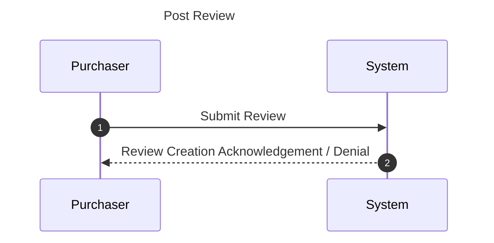
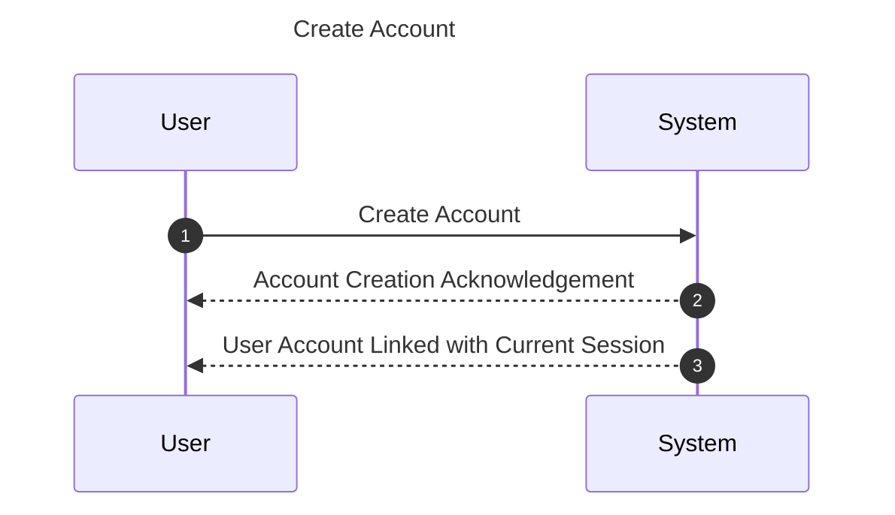
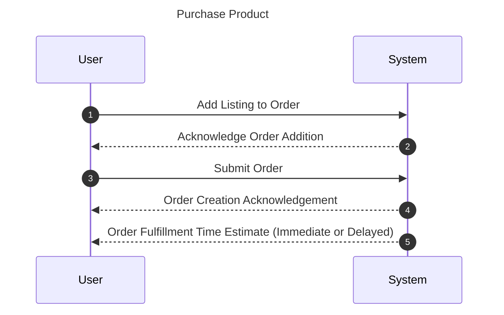
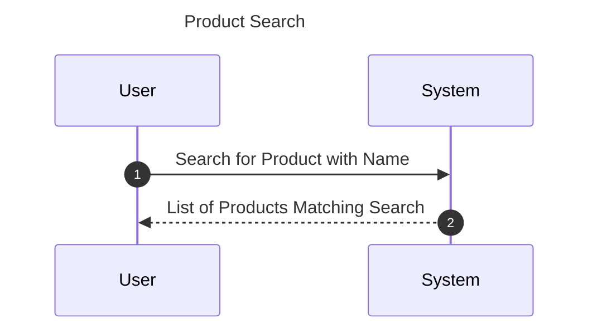

# Introduction
## Purpose
This document outlines the system requirements for developing a basic ecommerce website. The website’s core functionality is to support online retail operations, including posting product listings, shopping cart functionality, user accounts, and order processing.

## Scope
The ecommerce webservice will include the following key components:
Product catalog and inventory management
User registration and authentication
Shopping cart functionality
Order placement and processing
Basic search and filtering capabilities


# Design-Level Class Diagrams



## Psuedocode
```
searchForProduct(name: String) List<Product>
	GET Listings from Database
	FOR listing in Listings
		IF listing.name contains name
			RETURN Product
		END IF
	RETURN null
	END FOR
	
submitListing(listing: Listing)
	POST listing to Database
	RETURN
	
submitOrder(order: Order)
	POST order to Database
	GET orders from Database
	BOOLEAN allInStock = TRUE
	FOR order in orders
		FOR listing in order.items
			IF !(listing.quantity > 0)
				allInStock = FALSE
			END IF
		END FOR
	END FOR
	IF allInStock
		fufillOrder(order)
	RETURN
	
submitReview(review: Review)
	POST review to Database
	RETURN
	
totalPriceInCents() int
	INT total = 0
	FOR item in items
		total += item.priceInCents
	END FOR
	RETURN total
```

# Object Statechart Diagrams

1. Order


2. Review


3. Listing


4. Credit Card


5. User

   


# First Cut Domain Sequence Diagram










       
