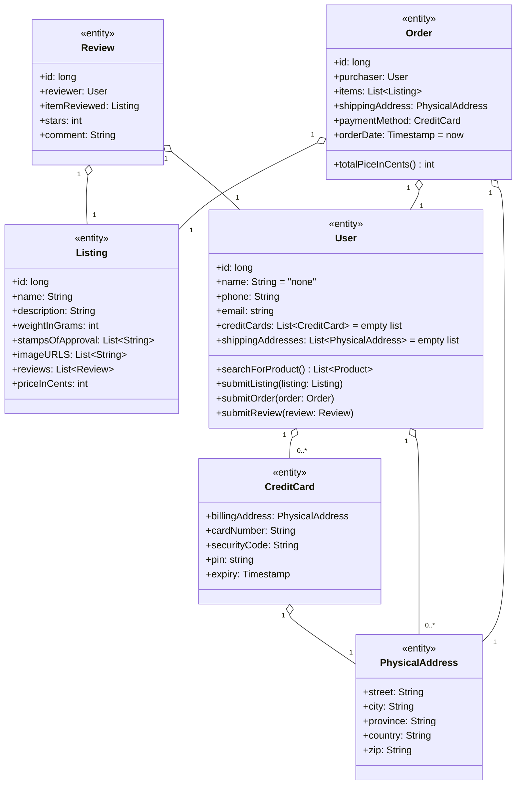
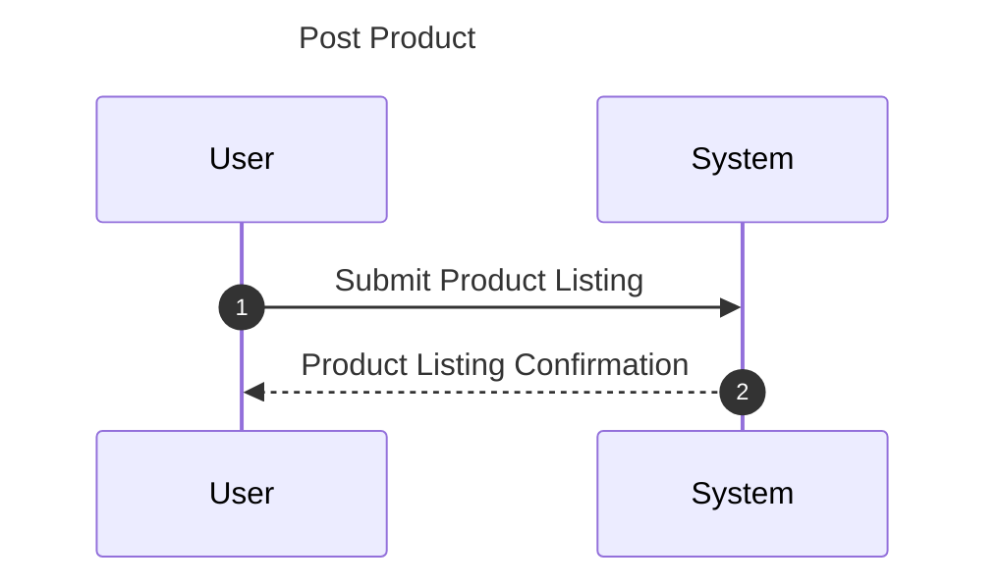
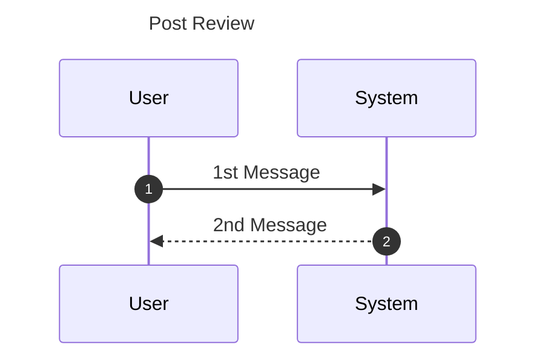
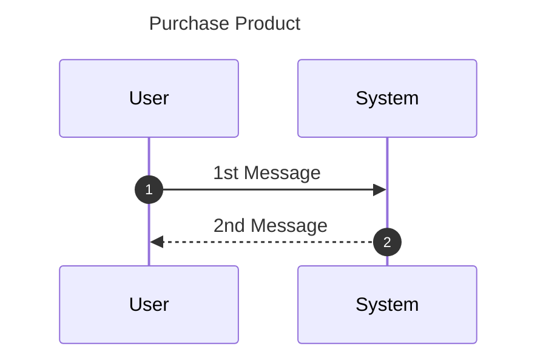
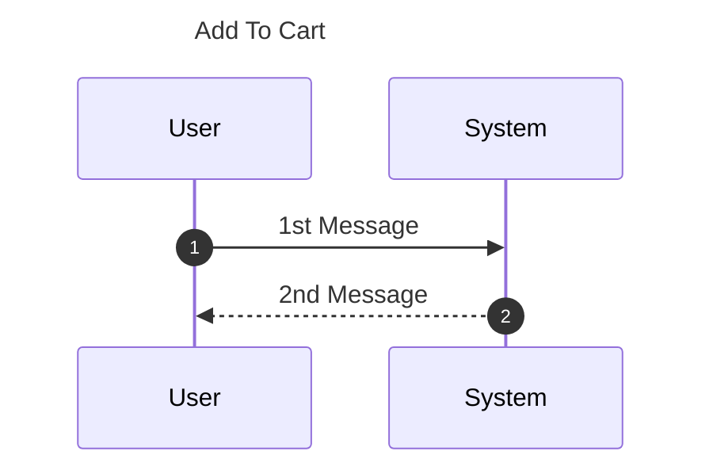
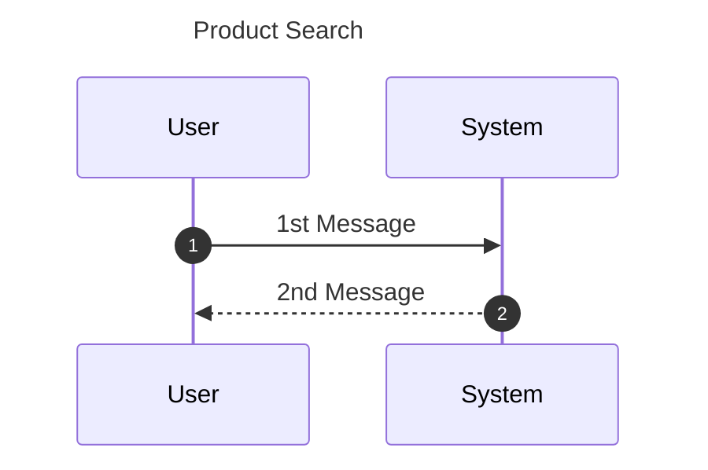

# Introduction

## Purpose
This document outlines the system requirements for developing a basic ecommerce website. The website’s core functionality is to support online retail operations, including posting product listings, shopping cart functionality, user accounts, and order processing.

## Scope
The ecommerce webservice will include the following key components:
Product catalog and inventory management
User registration and authentication
Shopping cart functionality
Order placement and processing
Basic search and filtering capabilities

# Description Model

## System Requirements

1. User Authentication
   - Output:
       - Successful login confirmation.
       - User profile access post-login.
       - Error messages for failed login attempts.
   - Input:
     - User credentials (username/email, password).
     - OAuth tokens for Google Sign-In.
   - Processes:
     - Validate user credentials.
     - Handle OAuth token for Google Sign-In.
2. Create a new user account.
   - Encrypt and store user passwords securely.
      Performance:
      Quick response time for authentication requests (<1 second).
      High availability and reliability of authentication services.
      Security:
      Use HTTPS for all authentication-related communications.
      Implement account lockout after multiple failed login attempts.
      Use strong encryption (e.g., bcrypt) for password storage.
      Ensure OAuth tokens are securely managed and stored.
3. Product Listing

## Requirements Categories

### Output Requirements
- The system must provide clear and accurate information at each step of user interaction.
- Product listings, reviews, purchase confirmations, and shipping status must be displayed in an intuitive and user-friendly manner.

### Input Requirements
- User inputs must be validated and sanitized to ensure data integrity and security.
- The system must handle a variety of input formats, including text, numerical values, and payment details.

### Processing Requirements
- Efficient data handling and storage for all system functionalities.
- Secure authentication, payment processing, and data retrieval processes.
- Integration with third-party services (Google Sign-In, shipping services).

### Performance Requirements
- The system must be highly responsive, with quick loading times and minimal delays in user interactions.
- It must be scalable to handle increasing numbers of users and transactions without performance degradation.

### Security Requirements
- All sensitive data must be encrypted and securely stored.
- The system must implement robust access controls and authentication mechanisms.
- Regular security audits and updates to protect against vulnerabilities.

# Class Diagram

# Use Case Diagram

# Use Case Descriptions

## Post Product:
The user (vendor) has the ability to post a product to the site for people to search and purchase.  
**Trigger** Vendor hits the Create New Listing button.  
**Precondition** Account needs to be created first, Account type switched to Vendor  
**Postcondition** New listing will be made for the product for customers to purchase.  
**Main Scenario**  
User Interactions:  
1. Vendor hits the Create New Listing button.
2. Vendor types in all of the products details including name, price, quantity, as well as weight and dimensions
3. Vendor hits the Submit button.
4. New listing is created and is ready to be viewed by customers.

System Responses:  
1.1  System opens the page to create a new listing  
3.1  System posts to the backend a request to make a new listing in the system database containing   	 all of the included details.  
**Exceptions** If all fields are not filled out listing cannot be initiated

## Post Review:  
The user has the ability to post a review to the site for customers to observe and comment on.  
**Trigger** User clicks the Make Review button.  
**Precondition** Account needs to be created first, must be viewing a product.  
**Postcondition** A review will be listed for the product.  
**Main Scenario**  
User Interactions:  
1. User clicks the Make Review button.
2. User types in the review, rating from 1-5 along with an open ended comment section to talk about the product.
3. User clicks the Submit button.
4. New comment is created and is ready to be viewed by customers.

System Responses:  
1.1  System opens the dropdown to enter in rating and comment for the review.  
3.1  System adds the review to the database and displays it for other users.  
**Exceptions** If all fields are not filled out, review cannot be initiated.

## Create an account:
A customer has the ability to create an account to make purchases and also post products along with many other features.  
**Trigger** Customer clicks Sign Up button.  
**Precondition**  Customer must have an email address and a phone number.  
**Postcondition** An account will be created for the customer to use our site's features.  
**Main Scenario**  
User Interactions:  
1. Customer clicks the Sign Up button.
2. Customer types in email address, phone number, and the customers preferred password along with a password confirmation.
3. Customer clicks the Sign Up button.
4. New account is created for the customer to use.

System Responses:  
1.1  System opens the account creation page, utilizing a default sign up page along with a google Sign-Up.  
3.1  System adds user to the database.  
**Exceptions** If all fields are not filled out, account cannot be created. Invalid email address or phone number will also result in an account not being created.

## Purchase Product:
A customer has the ability to purchase a product online and have it shipped to their house.  
**Trigger** Customer clicks Make Order button.  
**Precondition** Customer must have an account created, Customers must have an item in their cart and be viewing the cart page to proceed.  
**Postcondition** Items in customers cart will be purchased, charging the customer, and shipped to their shipping address.  
**Main Scenario**  
User Interactions:  
1. Customer clicks the Make Order button.
2. Customer selects a payment type (Credit Card (Visa, MasterCard, Amex), Debit Card, Gift Card) .
3. Customer types in name, and shipping address.
4. Customer clicks the Purchase button.
5. Successfully purchased an item.

System Responses:  
1.1  System opens the purchase item page, containing the payment type, along with fields for credit		 card / debit card information, and fields for the shipping address, billing address.  
4.1  System sends request to the backend stating there has been an item purchased and takes the 	 	 amount out of inventory and the shipment process begins.  
**Exceptions** If payment information is invalid or the shipping address / billing address is invalid.

## Add Product to Cart:
A customer has the ability to add items to their cart, saving items to be purchased at a later date.  
**Trigger** Customer clicks Add to Cart button.  
**Precondition** Customer must have an account created, Customers must be viewing a product listing.  
**Postcondition** Item will be added to the customers cart..  
**Main Scenario**
User Interactions:  
1. Customer clicks the Add to Cart button.
2. Item has been successfully added to the cart.

System Responses:  
1.1  System adds the items to the table containing the specific users cart items  
**Exceptions** None

## Product Search:
A customer has the ability to search for keywords and get a result of different items relating to their search term.
Trigger: Customer clicks the search bar field.   
**Precondition** Customer must have an account created.  
**Postcondition** Products relating to the customers searched keywords will be displayed..  
**Main Scenario**  
User Interactions:  
1. Customer clicks the search bar field.
2. Customer clicks enter or search.
3. A list of items relating to the search keyword will be displayed.

System Responses:  
2.1  A request is sent to the backend to retrieve a list of items that relate to the keyword in the search		 field and display it to the frontend.  
**Exceptions** If the user types in nothing the search will not proceed.

# System Sequence Charts

