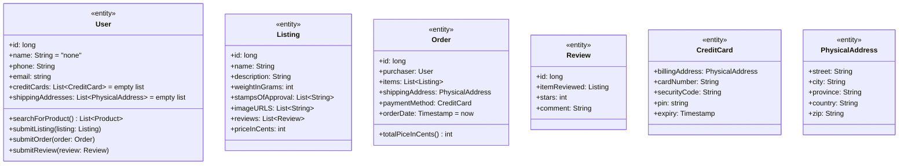
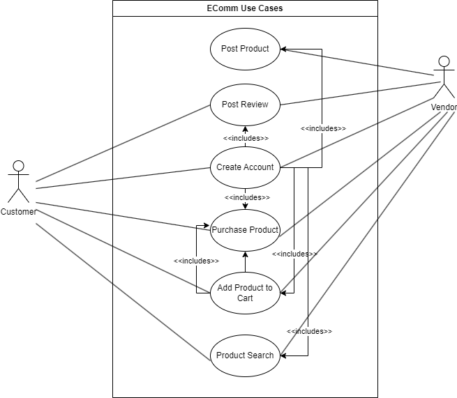

# Introduction

## Purpose
This document outlines the system requirements for developing a basic ecommerce website. The website’s core functionality is to support online retail operations, including posting product listings, shopping cart functionality, user accounts, and order processing.

## Scope
The ecommerce webservice will include the following key components:
Product catalog and inventory management
User registration and authentication
Shopping cart functionality
Order placement and processing
Basic search and filtering capabilities

# Description Model

## System Requirements

1. User Authentication
   - Output:
       - Successful login confirmation.
       - User profile access post-login.
       - Error messages for failed login attempts.
   - Input:
     - User credentials (username/email, password).
     - OAuth tokens for Google Sign-In.
   - Processes:
     - Validate user credentials.
     - Handle OAuth token for Google Sign-In.
2. Create a new user account.
   - Encrypt and store user passwords securely.
      Performance:
      Quick response time for authentication requests (<1 second).
      High availability and reliability of authentication services.
      Security:
      Use HTTPS for all authentication-related communications.
      Implement account lockout after multiple failed login attempts.
      Use strong encryption (e.g., bcrypt) for password storage.
      Ensure OAuth tokens are securely managed and stored.
3. Product Listing

## Requirements Categories

### Output Requirements
- The system must provide clear and accurate information at each step of user interaction.
- Product listings, reviews, purchase confirmations, and shipping status must be displayed in an intuitive and user-friendly manner.

### Input Requirements
- User inputs must be validated and sanitized to ensure data integrity and security.
- The system must handle a variety of input formats, including text, numerical values, and payment details.

### Processing Requirements
- Efficient data handling and storage for all system functionalities.
- Secure authentication, payment processing, and data retrieval processes.
- Integration with third-party services (Google Sign-In, shipping services).

### Performance Requirements
- The system must be highly responsive, with quick loading times and minimal delays in user interactions.
- It must be scalable to handle increasing numbers of users and transactions without performance degradation.

### Security Requirements
- All sensitive data must be encrypted and securely stored.
- The system must implement robust access controls and authentication mechanisms.
- Regular security audits and updates to protect against vulnerabilities.

# Class Diagram

# Use Case Diagram

# System Sequence Charts

