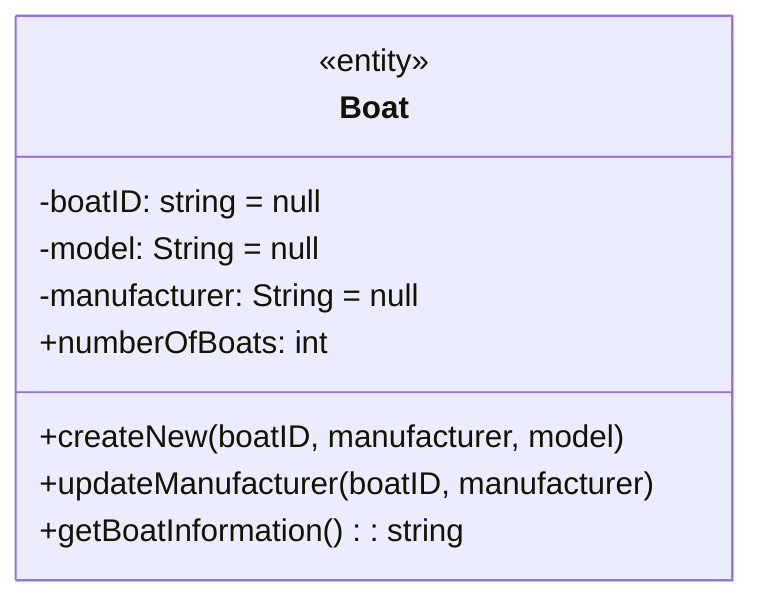

# UML Class Diagram Example

```mermaid
classDiagram
    class Boat {
        <<entity>>
        -boatID: string = null
        -model: String = null
        -manufacturer: String = null
        +numberOfBoats: int
        +createNew(boatID, manufacturer, model)
        +updateManufacturer(boatID, manufacturer)
        +getBoatInformation(): string
    }
```
