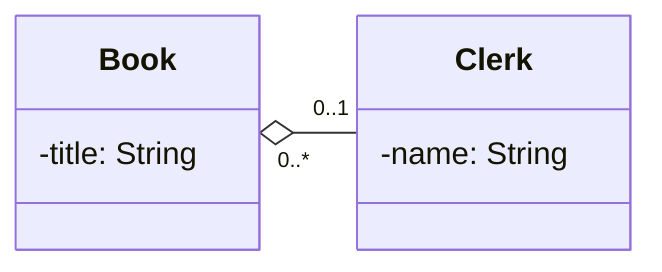

# CRC Cards

A CRC card is a Class Responsibilities Collaborator.
It has 3 main components:  
1. Classes
2. Responsibilities (methods)
3. Collaborators (other classes involved in use cases)

```mermaid
classDiagram
    direction LR
    class Book{
        -title: String
    }
    class Clerk{
        -name: String
    }
    
    Book "0..*" o-- "0..1" Clerk
```

